<table>
<tr>
<td valign="top"></td>
<td valign="top"></td>
</tr>
</table>

## Shreyansh Jain

**Full-Stack Developer · FinTech Research · UI/UX Design**

 

<!-- animated contribution graph, refreshed daily by the workflow -->

